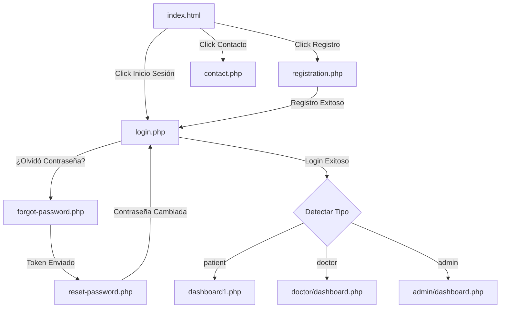
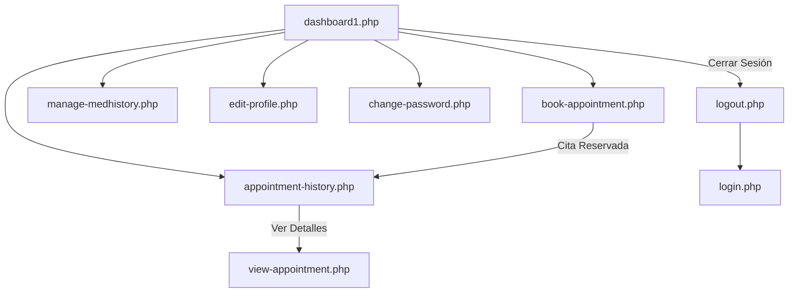
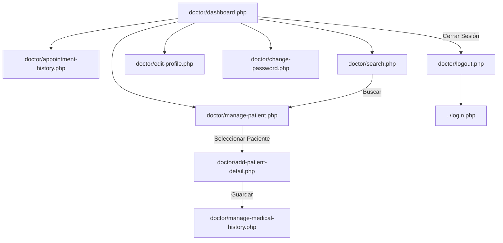
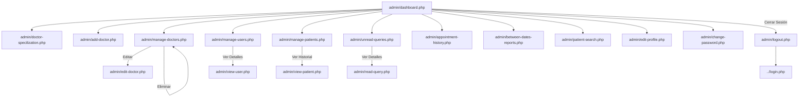

# Flujo Completo de Vistas - HMS Clínica Dental Muelitas

## Resumen Ejecutivo

El Hospital Management System (HMS) de Clínica Dental Muelitas contiene **35 vistas principales** distribuidas en tres roles de usuario: Pacientes, Doctores y Administradores.

**Estado Actual:**
- ✅ Login unificado funcional
- ⚠️ Dashboards con problemas de renderizado
- ❓ 28 vistas no probadas después de migración

---

## Arquitectura de Vistas

```
Sistema HMS
│
├── Vistas Públicas (Sin autenticación)
│   ├── index.html (página de inicio)
│   ├── contact.php (contacto)
│   ├── login.php (login unificado) ⭐ NUEVO
│   ├── registration.php (registro de pacientes)
│   ├── forgot-password.php (recuperación)
│   └── reset-password.php (reseteo)
│
├── Vistas de Paciente (user_type = 'patient')
│   ├── dashboard1.php (panel principal) ⚠️
│   ├── book-appointment.php (reservar cita)
│   ├── appointment-history.php (historial)
│   ├── manage-medhistory.php (historia médica)
│   ├── edit-profile.php (editar perfil)
│   ├── change-password.php (cambiar contraseña)
│   └── logout.php (cerrar sesión)
│
├── Vistas de Doctor (user_type = 'doctor')
│   ├── doctor/dashboard.php (panel principal) ❌
│   ├── doctor/appointment-history.php (historial de citas)
│   ├── doctor/manage-patient.php (gestión de pacientes)
│   ├── doctor/search.php (buscar paciente)
│   ├── doctor/add-patient-detail.php (añadir detalles)
│   ├── doctor/manage-medical-history.php (historia médica)
│   ├── doctor/edit-profile.php (editar perfil)
│   ├── doctor/change-password.php (cambiar contraseña)
│   └── doctor/logout.php (cerrar sesión)
│
└── Vistas de Admin (user_type = 'admin')
    ├── admin/dashboard.php (panel principal) ❌
    ├── admin/doctor-specilization.php (especialidades)
    ├── admin/add-doctor.php (añadir doctor)
    ├── admin/manage-doctors.php (gestión de doctores)
    ├── admin/manage-users.php (gestión de usuarios)
    ├── admin/manage-patients.php (gestión de pacientes)
    ├── admin/unread-queries.php (consultas sin leer)
    ├── admin/read-query.php (leer consultas)
    ├── admin/appointment-history.php (historial de citas)
    ├── admin/between-dates-reports.php (reportes por fecha)
    ├── admin/patient-search.php (buscar paciente)
    ├── admin/edit-profile.php (editar perfil)
    ├── admin/change-password.php (cambiar contraseña)
    └── admin/logout.php (cerrar sesión)
```

---

## Flujo Detallado por Rol

### 1. Flujo Público (Sin Autenticación)



**Vistas Públicas (6 vistas):**

#### 1.1 index.html
- **URL:** `/hospital/index.html`
- **Descripción:** Página de inicio de la clínica
- **Características:**
  - Slider con 3 imágenes de la clínica
  - Información de servicios
  - Links a login y registro
  - Sección de contacto
- **Estado:** ✅ Funcional

#### 1.2 login.php ⭐ NUEVO
- **URL:** `/hospital/hms/login.php`
- **Descripción:** Login unificado para todos los usuarios
- **Características:**
  - Auto-detección de tipo de usuario
  - Prepared statements (seguro contra SQL injection)
  - password_verify() para bcrypt
  - Redirección automática según rol
- **Campos:**
  - Email (input text)
  - Password (input password)
- **Redirecciones:**
  - patient → `dashboard1.php`
  - doctor → `doctor/dashboard.php`
  - admin → `admin/dashboard.php`
- **Estado:** ✅ Funcional

#### 1.3 registration.php
- **URL:** `/hospital/hms/registration.php`
- **Descripción:** Registro de nuevos pacientes
- **Campos:**
  - Full Name
  - Address
  - City
  - Gender
  - Email
  - Password
  - Password Confirmation
- **Acción:** Crea usuario tipo 'patient' en BD
- **Estado:** ✅ Funcional (actualizado a login.php)

#### 1.4 contact.php
- **URL:** `/hospital/contact.php`
- **Descripción:** Formulario de contacto público
- **Campos:**
  - Nombre
  - Email
  - Teléfono
  - Mensaje
- **Acción:** Guarda consulta en tabla `tblcontactus`
- **Estado:** ❓ No probado

#### 1.5 forgot-password.php
- **URL:** `/hospital/hms/forgot-password.php`
- **Descripción:** Recuperación de contraseña
- **Proceso:**
  1. Usuario ingresa email
  2. Sistema genera token
  3. Envía email con link
  4. Redirige a reset-password.php
- **Estado:** ✅ Actualizado (referencia a login.php)

#### 1.6 reset-password.php
- **URL:** `/hospital/hms/reset-password.php`
- **Descripción:** Resetear contraseña con token
- **Campos:**
  - Nueva contraseña
  - Confirmar contraseña
- **Validación:** Token debe ser válido y no expirado
- **Estado:** ✅ Actualizado (referencia a login.php)

---

### 2. Flujo de Paciente (user_type = 'patient')



**Vistas de Paciente (7 vistas):**

#### 2.1 dashboard1.php ⚠️
- **URL:** `/hospital/hms/dashboard1.php`
- **Descripción:** Panel principal del paciente
- **Widgets:**
  - Mis citas programadas (contador)
  - Mi historial de citas (enlace)
  - Mi historia médica (enlace)
  - Mi perfil (enlace)
- **Problema Reportado:** Muestra opciones pero están vacías
- **Estado:** ⚠️ Parcialmente funcional

#### 2.2 book-appointment.php
- **URL:** `/hospital/hms/book-appointment.php`
- **Descripción:** Reservar nueva cita
- **Campos:**
  - Especialidad (select)
  - Doctor (select dependiente)
  - Fecha (date picker)
  - Hora (time picker)
  - Síntomas (textarea)
- **Validación:**
  - Doctor debe estar disponible
  - No permitir citas pasadas
- **Estado:** ❓ No probado

#### 2.3 appointment-history.php
- **URL:** `/hospital/hms/appointment-history.php`
- **Descripción:** Historial de todas las citas del paciente
- **Muestra:**
  - Fecha de cita
  - Doctor asignado
  - Especialidad
  - Estado (pending/confirmed/cancelled)
  - Acciones (ver detalles, cancelar)
- **Estado:** ❓ No probado

#### 2.4 manage-medhistory.php
- **URL:** `/hospital/hms/manage-medhistory.php`
- **Descripción:** Historia médica del paciente
- **Muestra:**
  - Presión arterial
  - Peso
  - Glucosa en sangre
  - Temperatura corporal
  - Prescripciones médicas
- **Añadido por:** Doctores (no editable por paciente)
- **Estado:** ❓ No probado

#### 2.5 edit-profile.php
- **URL:** `/hospital/hms/edit-profile.php`
- **Descripción:** Editar perfil del paciente
- **Campos Editables:**
  - Nombre completo
  - Dirección
  - Ciudad
  - Género
  - Email (no editable)
- **Estado:** ❓ No probado

#### 2.6 change-password.php
- **URL:** `/hospital/hms/change-password.php`
- **Descripción:** Cambiar contraseña del paciente
- **Campos:**
  - Contraseña actual
  - Nueva contraseña
  - Confirmar nueva contraseña
- **Validación:**
  - Contraseña actual debe coincidir
  - Nueva contraseña debe ser diferente
- **Estado:** ❓ No probado

#### 2.7 logout.php
- **URL:** `/hospital/hms/logout.php`
- **Descripción:** Cerrar sesión del paciente
- **Acción:**
  - Destruye sesión
  - Limpia cookies
  - Redirige a login.php
- **Estado:** ✅ Funcional

---

### 3. Flujo de Doctor (user_type = 'doctor')



**Vistas de Doctor (9 vistas):**

#### 3.1 doctor/dashboard.php ❌
- **URL:** `/hospital/hms/doctor/dashboard.php`
- **Descripción:** Panel principal del doctor
- **Widgets:**
  - Total de pacientes asignados
  - Citas del día
  - Citas pendientes
  - Pacientes nuevos
- **Problema:** Página en blanco después del login
- **Causa Probable:**
  - Includes no cargan (sidebar.php, header.php)
  - URL hardcodeada corregida pero puede haber otros problemas
- **Estado:** ❌ No funcional

#### 3.2 doctor/appointment-history.php
- **URL:** `/hospital/hms/doctor/appointment-history.php`
- **Descripción:** Historial de citas del doctor
- **Muestra:**
  - Paciente
  - Fecha y hora
  - Estado
  - Acciones (confirmar, cancelar, añadir diagnóstico)
- **Estado:** ❓ No probado

#### 3.3 doctor/manage-patient.php
- **URL:** `/hospital/hms/doctor/manage-patient.php`
- **Descripción:** Lista de todos los pacientes del doctor
- **Muestra:**
  - Nombre del paciente
  - Email
  - Teléfono
  - Última cita
  - Acciones (ver historial, añadir detalles)
- **Estado:** ❓ No probado

#### 3.4 doctor/search.php
- **URL:** `/hospital/hms/doctor/search.php`
- **Descripción:** Buscar paciente por nombre/email
- **Búsqueda:**
  - Por nombre
  - Por email
  - Por teléfono
- **Resultado:** Muestra lista de coincidencias
- **Estado:** ❓ No probado

#### 3.5 doctor/add-patient-detail.php
- **URL:** `/hospital/hms/doctor/add-patient-detail.php`
- **Descripción:** Añadir/actualizar detalles médicos del paciente
- **Campos:**
  - Presión arterial
  - Peso
  - Glucosa
  - Temperatura
  - Diagnóstico
  - Prescripción
- **Estado:** ❓ No probado

#### 3.6 doctor/manage-medical-history.php
- **URL:** `/hospital/hms/doctor/manage-medical-history.php`
- **Descripción:** Ver/editar historia médica completa
- **Muestra:**
  - Historial de visitas
  - Diagnósticos anteriores
  - Prescripciones activas
  - Alergias
  - Notas médicas
- **Estado:** ❓ No probado

#### 3.7 doctor/edit-profile.php
- **URL:** `/hospital/hms/doctor/edit-profile.php`
- **Descripción:** Editar perfil del doctor
- **Campos Editables:**
  - Nombre
  - Especialización
  - Dirección
  - Teléfono de contacto
  - Honorarios por consulta
- **Estado:** ❓ No probado

#### 3.8 doctor/change-password.php
- **URL:** `/hospital/hms/doctor/change-password.php`
- **Descripción:** Cambiar contraseña del doctor
- **Estado:** ❓ No probado

#### 3.9 doctor/logout.php
- **URL:** `/hospital/hms/doctor/logout.php`
- **Descripción:** Cerrar sesión del doctor
- **Redirige a:** ../login.php
- **Estado:** ✅ Probablemente funcional

---

### 4. Flujo de Admin (user_type = 'admin')



**Vistas de Admin (13+ vistas):**

#### 4.1 admin/dashboard.php ❌
- **URL:** `/hospital/hms/admin/dashboard.php`
- **Descripción:** Panel principal del administrador
- **Widgets:**
  - Total de usuarios registrados
  - Total de doctores
  - Total de pacientes
  - Citas del día
  - Consultas sin leer
- **Problema:** Probablemente en blanco (mismo que doctor)
- **Estado:** ❌ Probablemente no funcional

#### 4.2 admin/doctor-specilization.php
- **URL:** `/hospital/hms/admin/doctor-specilization.php`
- **Descripción:** Gestión de especialidades médicas
- **Acciones:**
  - Añadir nueva especialidad
  - Editar especialidad existente
  - Eliminar especialidad (si no tiene doctores)
- **Campos:**
  - Nombre de especialidad
  - Fecha de creación
- **Estado:** ❓ No probado

#### 4.3 admin/add-doctor.php
- **URL:** `/hospital/hms/admin/add-doctor.php`
- **Descripción:** Añadir nuevo doctor al sistema
- **Campos:**
  - Especialidad (select)
  - Nombre del doctor
  - Dirección
  - Honorarios por consulta
  - Número de contacto
  - Email
  - Contraseña (auto-generada o manual)
- **Acción:** Crea usuario tipo 'doctor' en BD
- **Estado:** ❓ No probado

#### 4.4 admin/manage-doctors.php
- **URL:** `/hospital/hms/admin/manage-doctors.php`
- **Descripción:** Lista y gestión de todos los doctores
- **Muestra:**
  - Nombre
  - Especialidad
  - Email
  - Teléfono
  - Fecha de registro
  - Estado (activo/inactivo)
  - Acciones (editar, eliminar, bloquear)
- **Estado:** ❓ No probado

#### 4.5 admin/manage-users.php
- **URL:** `/hospital/hms/admin/manage-users.php`
- **Descripción:** Gestión de todos los usuarios (vista unificada)
- **Muestra:**
  - Email
  - Nombre completo
  - Tipo de usuario
  - Estado
  - Fecha de registro
  - Último login
  - Acciones (ver, editar, bloquear)
- **Estado:** ❓ No probado

#### 4.6 admin/manage-patients.php
- **URL:** `/hospital/hms/admin/manage-patients.php`
- **Descripción:** Gestión específica de pacientes
- **Muestra:**
  - Nombre
  - Email
  - Ciudad
  - Género
  - Fecha de registro
  - Total de citas
  - Acciones (ver historial, editar, eliminar)
- **Estado:** ❓ No probado

#### 4.7 admin/unread-queries.php
- **URL:** `/hospital/hms/admin/unread-queries.php`
- **Descripción:** Consultas de contacto sin leer
- **Muestra:**
  - Nombre del remitente
  - Email
  - Asunto
  - Fecha
  - Acciones (leer, marcar como leído)
- **Estado:** ❓ No probado

#### 4.8 admin/read-query.php
- **URL:** `/hospital/hms/admin/read-query.php`
- **Descripción:** Ver detalles de consulta específica
- **Muestra:**
  - Nombre
  - Email
  - Teléfono
  - Mensaje completo
  - Fecha
  - Estado
- **Acciones:**
  - Marcar como leído
  - Responder (si hay integración email)
- **Estado:** ❓ No probado

#### 4.9 admin/appointment-history.php
- **URL:** `/hospital/hms/admin/appointment-history.php`
- **Descripción:** Historial completo de todas las citas
- **Muestra:**
  - Paciente
  - Doctor
  - Especialidad
  - Fecha y hora
  - Estado
  - Acciones (ver detalles, cancelar)
- **Filtros:**
  - Por doctor
  - Por paciente
  - Por fecha
  - Por estado
- **Estado:** ❓ No probado

#### 4.10 admin/between-dates-reports.php
- **URL:** `/hospital/hms/admin/between-dates-reports.php`
- **Descripción:** Reportes entre fechas específicas
- **Opciones:**
  - Citas entre fechas
  - Nuevos usuarios entre fechas
  - Ingresos entre fechas
- **Formatos:** PDF, Excel, CSV
- **Estado:** ❓ No probado

#### 4.11 admin/patient-search.php
- **URL:** `/hospital/hms/admin/patient-search.php`
- **Descripción:** Búsqueda avanzada de pacientes
- **Búsqueda por:**
  - Nombre
  - Email
  - Teléfono
  - Ciudad
  - Fecha de registro
- **Estado:** ❓ No probado

#### 4.12 admin/edit-profile.php
- **URL:** `/hospital/hms/admin/edit-profile.php`
- **Descripción:** Editar perfil del administrador
- **Campos:**
  - Username
  - Email
  - Permisos (JSON)
- **Estado:** ❓ No probado

#### 4.13 admin/change-password.php
- **URL:** `/hospital/hms/admin/change-password.php`
- **Descripción:** Cambiar contraseña del admin
- **Estado:** ❓ No probado

#### 4.14 admin/logout.php
- **URL:** `/hospital/hms/admin/logout.php`
- **Descripción:** Cerrar sesión del admin
- **Estado:** ✅ Probablemente funcional

---

## Resumen de Estado de Vistas

### Por Estado

| Estado | Cantidad | Descripción |
|--------|----------|-------------|
| ✅ Funcional | 7 | Probadas y funcionando correctamente |
| ⚠️ Parcial | 1 | Funciona pero con problemas |
| ❌ No funcional | 2 | Probadas y no funcionan |
| ❓ No probado | 25 | No se han probado después de migración |
| **TOTAL** | **35** | **Todas las vistas del sistema** |

### Desglose por Rol

| Rol | Total Vistas | Funcionales | Parciales | No Funcionales | No Probadas |
|-----|--------------|-------------|-----------|----------------|-------------|
| Público | 6 | 5 | 0 | 0 | 1 |
| Paciente | 7 | 1 | 1 | 0 | 5 |
| Doctor | 9 | 0 | 0 | 1 | 8 |
| Admin | 13 | 1 | 0 | 1 | 11 |
| **TOTAL** | **35** | **7** | **1** | **2** | **25** |

---

## Componentes Compartidos

### Includes Comunes

#### header.php
- **Ubicaciones:**
  - `/hms/include/header.php` (pacientes)
  - `/hms/doctor/include/header.php` (doctores)
  - `/hms/admin/include/header.php` (administradores)
- **Contiene:**
  - Meta tags
  - CSS includes
  - Navigation bar
  - User info dropdown
- **Problema Potencial:** Rutas relativas pueden fallar después de reestructuración

#### sidebar.php
- **Ubicaciones:**
  - `/hms/include/sidebar.php` (pacientes)
  - `/hms/doctor/include/sidebar.php` (doctores)
  - `/hms/admin/include/sidebar.php` (administradores)
- **Contiene:**
  - Menú de navegación
  - Links a todas las secciones
  - User avatar
  - Logout button
- **Problema Potencial:** Links pueden apuntar a páginas incorrectas

#### footer.php
- **Ubicaciones:**
  - `/hms/include/footer.php` (pacientes)
  - `/hms/doctor/include/footer.php` (doctores)
  - `/hms/admin/include/footer.php` (administradores)
- **Contiene:**
  - Copyright notice
  - Footer links
  - JS includes

#### config.php
- **Ubicación:** `/hms/include/config.php`
- **Contiene:**
  - Conexión a base de datos
  - Constantes del sistema
- **Estado:** ✅ Funcional

#### checklogin.php
- **Ubicaciones:**
  - `/hms/include/checklogin.php` (pacientes)
  - `/hms/doctor/include/checklogin.php` (doctores)
  - `/hms/admin/include/checklogin.php` (administradores)
- **Función:** Verificar si usuario está autenticado
- **Problema Identificado:** Redirecciona a `../admin.php` que no existe
- **Debe cambiar a:** `../login.php`
- **Estado:** ⚠️ Necesita corrección

---

## Rutas de Navegación

### Ruta Principal de Paciente
```
login.php → dashboard1.php → [Opción] → logout.php → login.php
```

### Ruta Principal de Doctor
```
login.php → doctor/dashboard.php → [Opción] → doctor/logout.php → login.php
```

### Ruta Principal de Admin
```
login.php → admin/dashboard.php → [Opción] → admin/logout.php → login.php
```

---

## Problemas Identificados

### 🔴 Críticos

1. **Dashboards en Blanco**
   - doctor/dashboard.php no renderiza
   - admin/dashboard.php probablemente tampoco
   - Bloquea acceso completo al sistema

2. **checklogin.php Redirige a Página Inexistente**
   - Redirige a `../admin.php`
   - Debería ser `../login.php`

### 🟡 Moderados

1. **25 Vistas Sin Probar**
   - No se sabe si funcionan después de migración
   - Pueden tener problemas de autenticación

2. **dashboard1.php Parcialmente Funcional**
   - Muestra estructura pero contenido vacío
   - Widgets no cargan datos

### 🟢 Menores

1. **Includes con Rutas Relativas**
   - Pueden fallar si estructura cambia
   - Considerar usar rutas absolutas

2. **Sin Manejo de Errores Uniforme**
   - Cada vista maneja errores diferente
   - No hay página de error centralizada

---

## Recomendaciones

### Inmediatas
1. ✅ Corregir checklogin.php en las 3 ubicaciones
2. ✅ Debuggear doctor/dashboard.php (añadir error_reporting)
3. ✅ Verificar que includes carguen correctamente
4. ✅ Probar cada dashboard individualmente

### Corto Plazo
1. ⏳ Probar sistemáticamente las 25 vistas restantes
2. ⏳ Crear página de error 404 centralizada
3. ⏳ Estandarizar estructura de includes
4. ⏳ Documentar dependencias entre vistas

### Largo Plazo
1. ⏳ Migrar a estructura MVC
2. ⏳ Implementar routing centralizado
3. ⏳ Crear componentes reutilizables
4. ⏳ Añadir testing automatizado

---

## Próximos Pasos

### Para Corrección de Dashboards:

1. **Verificar Sesiones:**
```php
// Añadir al inicio de doctor/dashboard.php
error_reporting(E_ALL);
ini_set('display_errors', 1);
session_start();
echo "<pre>";
print_r($_SESSION);
echo "</pre>";
```

2. **Verificar Includes:**
```php
// Verificar que archivos existan
if (file_exists('include/sidebar.php')) {
    include('include/sidebar.php');
} else {
    echo "ERROR: sidebar.php no encontrado";
}
```

3. **Verificar Consultas BD:**
```php
// Añadir manejo de errores
$query = mysqli_query($con, $sql);
if (!$query) {
    echo "Error: " . mysqli_error($con);
}
```

---

**Fecha de Última Actualización:** 12 de Octubre, 2025
**Total de Vistas Mapeadas:** 35
**Estado General:** ⚠️ Sistema funcional con dashboards críticos rotos
